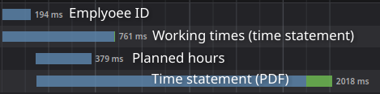
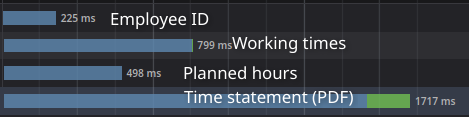

# Architecture

This document provides an overview of the anatomy of the browser extension and exchanged messages between different parts. The parts relevant for the overtime calculation are the
[Contentscript](https://developer.mozilla.org/en-US/docs/Mozilla/Add-ons/WebExtensions/Content_scripts), 
[Backgroundscript](https://developer.mozilla.org/en-US/docs/Mozilla/Add-ons/WebExtensions/Background_scripts) 
and [Web Workers](https://developer.mozilla.org/en-US/docs/Web/API/Web_Workers_API/Using_web_workers).

# Content Script (CS)

The content script runs in the context of the Fiori page. It is responsible for

1. Showing and updating the display inside the page, since this can only be done within the context of the page
2. Fetching data, since it can use the cookie credentials of the page without reading them

Any calculations or parsing is offloaded and not done here. See `src/extension/contentscript/contentscript.ts`.

## Fetches

To calculate the overtime the CS fetches multiple API endpoints which can be found in `src/extension/contentscript/fetchData/fetchData.ts`. Two requests are always sent on load in parallel:
- Employee ID
- Working times (time sheet)
 
Once the employee ID is retrieved and parsed two more parallel requests are made which both require an employee ID to be fetched:

- Planned hours
- Time statement (PDF file)

A request order like this typically looks like this:



To optimize loading times the employee id is **cached** (see [Storage](#storage)). This means after an initial run normally all four requests are ran simultaniously.
The employee id is refetched on every reload in case the cache would change. An [`AbortSignal`](https://developer.mozilla.org/en-US/docs/Web/API/AbortSignal) is used to cancel in flight requests.
The `src/extension/contentscript/getOvertime/overtimeManager` coordinates these requests and makes sure that thrown errors for planned hours and time statement are ignored when the employee id changes and the requests are restarted with new employee id.

A request order with a cached employee ID typically looks like this:



A request order with an invalid cached employee ID can look like this:


All requests are GET requests which means no CSRF token is required.
The SAP API offers batching requests which is avoided as the amount of requests is small and it would result in a POST request requiring a CSRF token. See old implementation of v4.0.0 on [2996cc56](https://github.com/clock-mate/extension/tree/2996cc565014fa1d2351f87c8eb21f5d8c5a7c6d). 

# Background script (BS)

The background script mostly functions as a message relay. It can start new web workers (can not be done from the content script) which run in their own thread and execution context.
The background script will forward messages to the web workers. The actual overtime calculation is done from the backgroundscript directly after data has been aggreagated by webworkers.
See `src/extension/backgroundscript/backgroundscript.ts`.

# Web workers (WW)

These perform the more computational expensive tasks since they can run in a separate thread. See `src/extension/backgroundscript/workeres/webWorkers`.

# Exchanged messages

CS, BS and WWs communicate with each other to exchange data. All communication is initiated by the CS. CS and BS wrap every communication in a `MessageObject`.
The message objects holds different commands which are mostly forwarded by BS to an according WW. WW sends custom object with expected data back to BS.
BS sends success message as `BackgroundResponse` optionally with the data.

TODO include ParsePlannedHours
```
Content Script ---- Background Script ---- Web worker
        <-MessageObject->          MessageObject->
                                     <-custom

Commands:
     ParseTimeSheet      ->            ->
        <- BackgroundResponse          <- overtime
           (no data)

     CompileTimeSatement ->            ->
        <- BackgroundResponse          <- overtime
           (no data)

     ParseEmployeeId     ->            ->
        <- BackgroundRespone           <- EmployeeIdData
           (with EmployeeIdData)

     GetOvertime
        <- BackgroundRespone
           (with OvertimeData)
```

On Chromium browsers an offscreen page is placed between the BS and WW and just forwards all messages in each direction. See [worker readme](../src/extension/backgroundscript/workers/chromium/README.md).

TODO document error messages communication

# Storage

TODO document what is stored in browser extension storage
