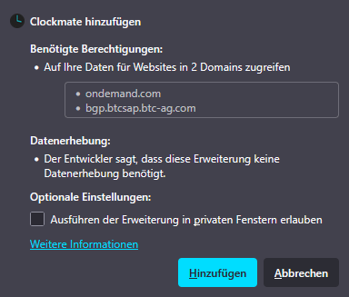

1. In Firefox die neuste Datei herunterladen: [Clockmate-firefox.xpi](https://github.com/clock-mate/extension/releases/latest/download/Clockmate-firefox.xpi)
2. Das Installieren von Erweiterungen von Github erlauben. "Installation fortsetzen" klicken 
   
3. Die Erweiterung hinzufügen. "Hinzufügen" klicken 
   
4. Installation bestätigen. "Ok" klicken 
   
5. Fertig! 🥳

<b>❓ Es kam kein Popup (Download mit anderem Browser durchgeführt)</b>

    <ol>
        <li>In Firefox neuen Tab mit <code>about:addons</code> öffnen</li>
        <li>Links "Erweiterungen" auswählen</li>
        <li>"Erweiterungen verwalten" Einstellungsrad klicken</li>
        <li>"Add-on aus Datei installieren..." klicken</li> 
         
        <li>Zur heruntergeladenen Datei "Clockmate-firefox.xpi" navigieren und auswählen</li>
        <li>"Öffnen" klicken</li>
        <li>Die Erweiterung hinzufügen. "Hinzufügen" klicken</li> 
        
        <li>Installation bestätigen. "Ok" klicken</li> 
        
        <li>Fertig! 🥳</li>
    </ol>

